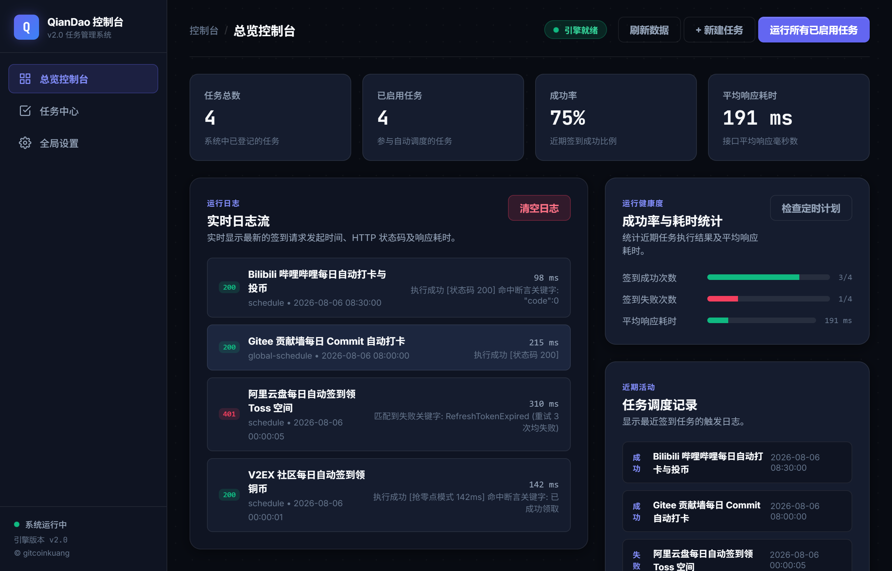
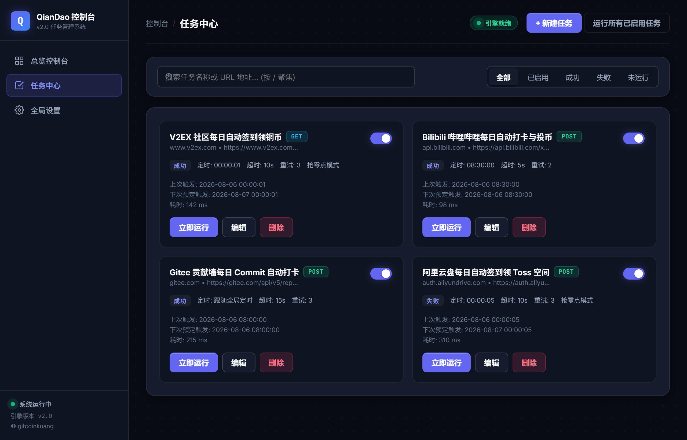
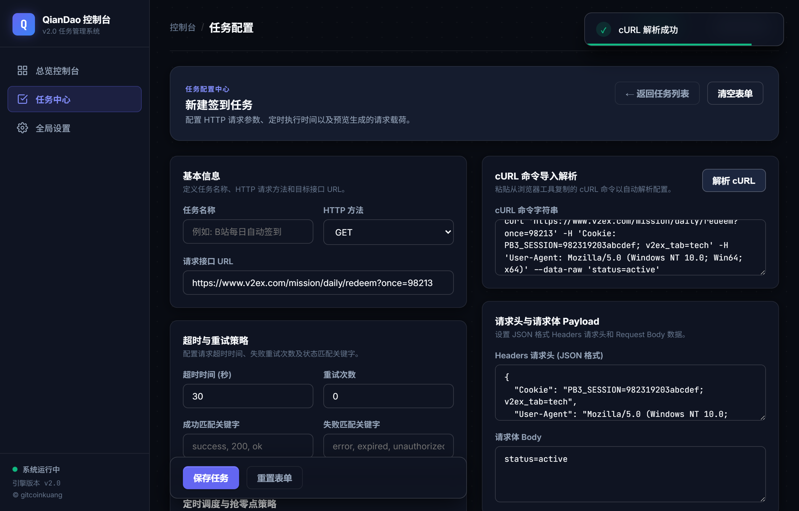
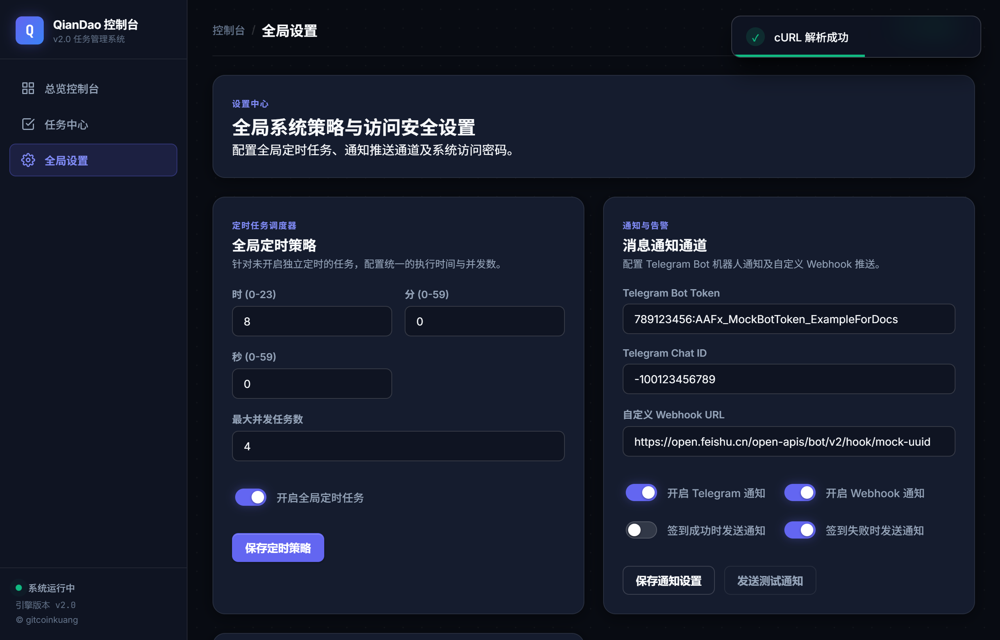
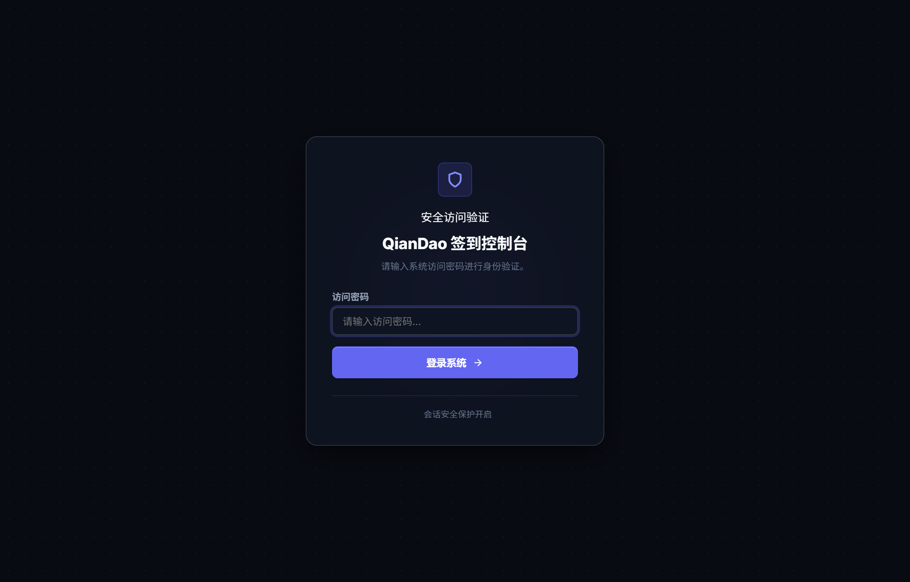

# QianDao V2 (签到控制台)

<p align="center">
  <b>轻量、稳定、开箱即用的自动签到与定时 HTTP 请求管理系统</b>
</p>

<p align="center">
  
  
  
  
</p>

---

## 📖 项目简介

**QianDao V2** 是一个基于 **Go + Gin** 开发的高性能自动化签到与 HTTP 定时请求管理系统。旨在帮助用户轻松管理每日自动签到、网络打卡、API 定时触发等场景。

系统支持直接粘贴浏览器导出的 `curl` 命令实现 **一键智能解析**，具备精准至 `时:分:秒` 的调度能力，并针对整点抢签场景独创了 **微秒级抢零点模式 (Aggressive Mode)**。项目采用零数据库依赖的 JSON 文件持久化设计，极其轻量，支持单文件直接编译并跨平台运行。

---

## 📸 界面预览

### 1. 总览控制台 (Dashboard)
实时统计任务执行成功率、平均响应耗时，提供直观的指标卡片与实时运行日志流。


### 2. 任务中心 (Task Management)
集中管理所有签到任务，提供关键词检索、状态筛选、一键手动触发以及独立的任务健康度状态展示。


### 3. cURL 智能解析与任务配置 (cURL Parser & Task Editor)
只需粘贴浏览器开发者工具中复制的 `cURL` 命令，系统将自动解析提取 URL、请求方法、请求头 Headers 与 Body 参数，无需繁琐人工填写。


### 4. 全局系统设置 (Global Settings)
支持 Telegram Bot 与 Custom Webhook（飞信/钉钉/企业微信等）多渠道消息推送、全局并发线程控制与定时计划排期配置。


### 5. 访问安全与登录面板 (Security & Login)
内置 Cookie Session 会话管理与访问密码防护，保护敏感的 Cookie 与 Token 参数不泄露。


---

## ✨ 核心特性

- 🚀 **cURL 智能解析**：直接粘贴浏览器 `cURL` 命令，自动一键解析并填充 URL、Method、Headers 与 Body 载荷。
- ⏱️ **秒级精细调度**：支持全局统一定时或单任务独立规则调度，精细化至 `HH:MM:SS`。
- ⚡ **抢零点优化模式 (Aggressive Mode)**：专为零点抢签场景设计，提供微秒级时间切片对齐、连接池预热复用与微秒级高频补发尝试。
- 🔍 **结果断言与自动重试**：支持自定义“成功关键字”与“失败关键字”匹配断言，提供 0-5 次失败自动重试与 1-120 秒超时阈值控制。
- 🔔 **多渠道通知推送**：内置 Telegram Bot 与 Custom Webhook 通知引擎，支持成功/失败状态差异化推送策略。
- 🔒 **访问安全与会话控制**：内置安全密码保护与基于安全 Cookie 的 Session 身份鉴权机制。
- 💾 **零数据库无依赖存储**：采用纯 JSON 文件 (`data/state.json`) 持久化，无外部数据库依赖，备份与迁移极简。

---

## 🛠️ 快速开始

### 运行环境要求

- **Go 语言环境**：Go 1.22 或更高版本

### 1. 本地直接运行

```bash
# 启动服务
go run .
```

### 2. 编译发布（单文件二进制）

```bash
# 编译体积小巧的独立可执行文件
go build -ldflags="-s -w" -o qiandao

# 运行应用
./qiandao
```

服务启动后，打开浏览器访问 `http://localhost:8080`。
首次登录请输入系统初始默认密码：`admin123456`（登录后可在全局设置中修改密码）。

---

## ⚙️ 环境变量配置

系统支持通过环境变量进行运行参数定制：

| 环境变量 | 默认值 | 说明 |
| :--- | :--- | :--- |
| `APP_TIMEZONE` | `Asia/Shanghai` | 应用时间计算与调度的目标时区 |
| `QIANGDAO_DEFAULT_PASSWORD` | `admin123456` | 首次部署系统时的默认登录密码 |
| `ADDR` | `0.0.0.0:8080` | 服务 HTTP 监听地址与端口 |

---

## 🔥 抢零点模式机制

针对热门平台“零点刚到即秒光”的抢签场景，可在任务配置页面勾选开启 **“抢零点模式”**：

1. **微秒级时间切片对齐**：调度引擎精准轮询微秒级刻度，精准在目标秒数交界瞬间触发。
2. **连接池预热与复用**：保持 HTTP Client 连接池长连接活跃，消除 TLS 握手与 DNS 查询耗时。
3. **高频补发保障**：到达目标时间点后瞬间并发补发重试，提升高并发网络下的签到成功率。
4. **精确发起时间日志**：历史记录中记录精准到毫秒级的系统请求发起时间点，便于分析各接口网络延时。

---

## 📂 数据存储与迁移

系统所有数据（任务配置、调度排期、推送密钥、密码 Hash 以及执行日志）均统一存储于本地文件：

```
data/state.json
```

- **数据备份**：只需复制备份 `data/state.json` 文件即可实现系统数据全量备份。
- **无缝迁移**：迁移新服务器时，只需将 `data/state.json` 拷贝至新环境同级 `data/` 目录并启动可执行程序即可瞬间恢复所有任务与历史记录。

---

## 📄 开源协议

本项目采用 [MIT License](LICENSE) 开源协议。
